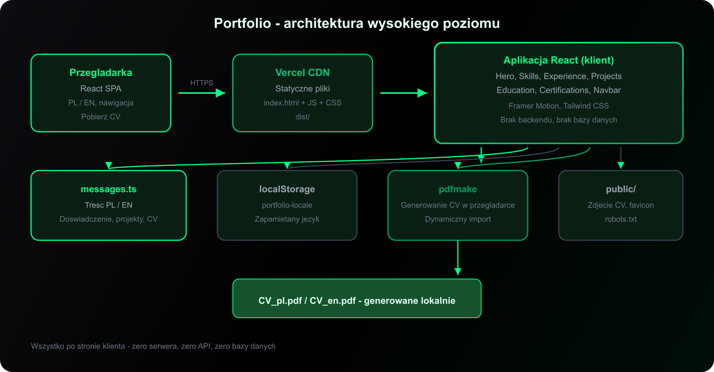
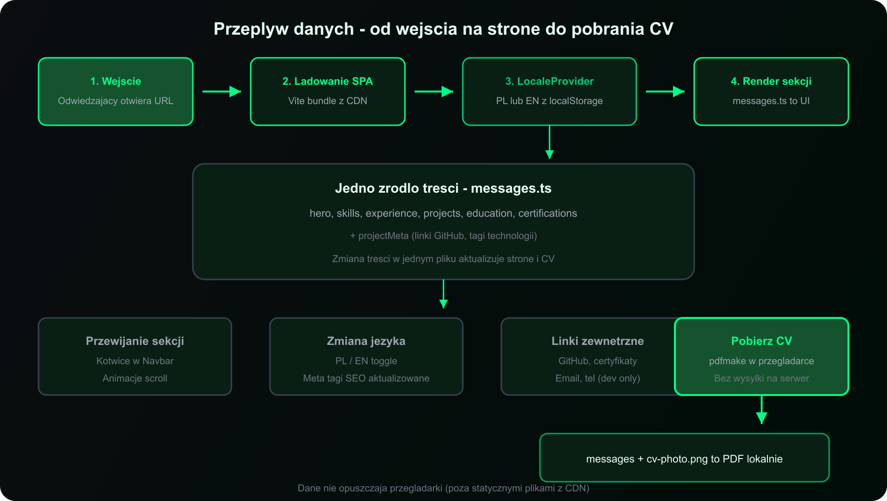
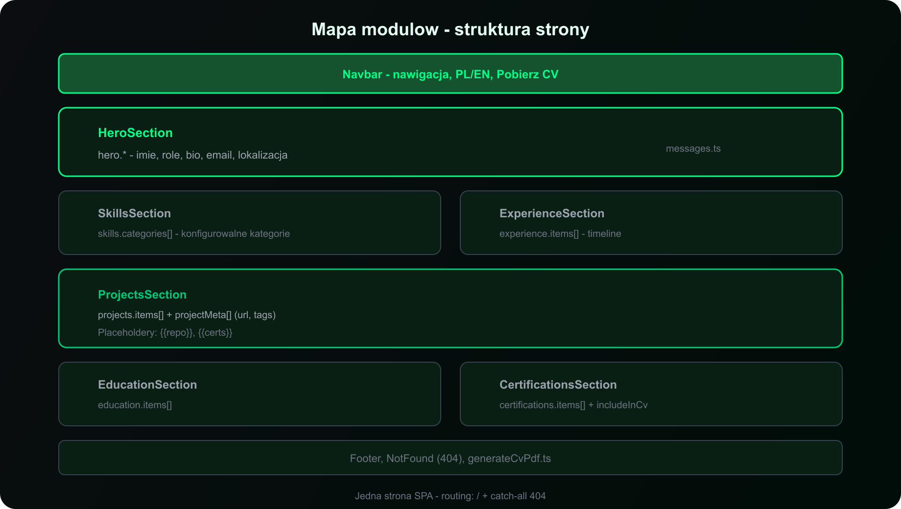
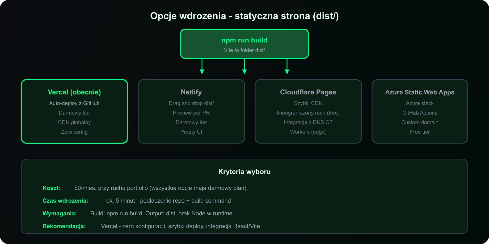

# portfolio-website



> Statyczna aplikacja React — jednostronicowe portfolio z dwujęzycznością (PL/EN) i generowaniem CV w przeglądarce.

**Demo:** [mikolajtanski.vercel.app](https://mikolajtanski.vercel.app)

---

## Czym jest ten projekt?

Lekki **SPA bez backendu** — treść w jednym pliku TypeScript, deploy jako statyczne pliki na CDN.

| Cecha | Opis |
|-------|------|
| **Architektura** | React + Vite, statyczny deploy, zero API |
| **i18n** | PL / EN, persystencja w localStorage |
| **CV PDF** | pdfmake, generowanie po stronie klienta |
| **Hosting** | Vercel (dowolny static host) |
| **Koszt utrzymania** | $0/mies. na free tier |

---

## Jak to działa



1. **CDN** serwuje bundle React z folderu `dist/`
2. **LocaleProvider** ustawia język (PL/EN) z localStorage
3. **Sekcje** renderują treść z `messages.ts`
4. **Pobierz CV** — pdfmake generuje PDF lokalnie w przeglądarce

---

## Struktura strony



Jedna strona SPA — moduły konfigurowalne przez `messages.ts`. Szczegóły → [architektura](docs/architecture.md)

---

## Dokumentacja

→ **[docs/README.md](docs/README.md)**

| Sekcja | Opis |
|--------|------|
| [Przegląd](docs/01-overview.md) | Problem, rozwiązanie, zakres MVP |
| [Wartość biznesowa](docs/02-business.md) | Koszt, czas, scenariusze wdrożenia |
| [Architektura](docs/architecture.md) | Warstwy, przepływ danych, diagramy |
| [Wdrożenie](docs/deployment.md) | Vercel, alternatywy, domena |
| [Personalizacja](docs/customization.md) | Edycja treści, język, CV |

---

## Szybki start

```bash
npm install
npm run dev      # http://localhost:8080
npm run build    # → dist/
npm run preview  # podgląd produkcji
```

| Komenda | Opis |
|---------|------|
| `npm run lint` | ESLint |
| `npm run test` | Vitest |

**Wymagania:** Node.js 18+ (20 LTS zalecane), npm 9+

---

## Stack

React 18 · TypeScript · Vite 5 · Tailwind CSS · Framer Motion · pdfmake · Vercel

---

## Wdrożenie



Build → `dist/` → dowolny static host. Obecnie: **Vercel**. Więcej → [wdrożenie](docs/deployment.md)

---

## Licencja

Projekt prywatny; wszelkie prawa zastrzeżone.
