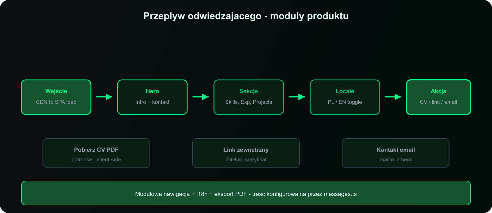

# portfolio-website — dokumentacja


> Statyczne portfolio SPA: React + Vite, dwujęzyczność, generowanie CV w przeglądarce, deploy na CDN.

**Demo:** [mikolajtanski.vercel.app](https://mikolajtanski.vercel.app)

---

## Spis treści

| | Sekcja | Co znajdziesz |
|---|--------|---------------|
| 📋 | [**Przegląd projektu**](01-overview.md) | Czym jest, jaki problem rozwiązuje, zakres MVP |
| 💼 | [**Wartość biznesowa**](02-business.md) | Koszt utrzymania, czas wdrożenia, scenariusze |
| 🏗 | [**Architektura**](architecture.md) | Warstwy, przepływ danych, diagramy |
| 🚀 | [**Wdrożenie**](deployment.md) | Hosting, Vercel, alternatywy |
| ✏️ | [**Personalizacja**](customization.md) | Edycja treści, język, zdjęcie CV |

---

## Szybki start

```bash
npm install
npm run dev      # http://localhost:8080
npm run build    # → dist/
npm run preview  # podgląd produkcji lokalnie
```

| Komenda | Opis |
|---------|------|
| `npm run lint` | ESLint |
| `npm run test` | Vitest (jednorazowo) |
| `npm run test:watch` | Vitest w trybie watch |

---

## Diagramy

### Przepływ danych


Od wejścia na stronę do pobrania CV — wszystko po stronie klienta.

→ [Architektura](architecture.md)

### Mapa modułów


Komponenty React ↔ klucze w `messages.ts`.

### Przepływ odwiedzającego



Modułowa nawigacja: Hero → sekcje → locale → akcja (CV / link / email).

### Wdrożenie


→ [Wdrożenie](deployment.md)

---

## Pliki graficzne

| Plik | Opis |
|------|------|
| [`assets/architecture.png`](assets/architecture.png) | Architektura wysokiego poziomu (PNG do README) |
| [`assets/data-flow.png`](assets/data-flow.png) | Przepływ danych |
| [`assets/user-journey.png`](assets/user-journey.png) | Przepływ odwiedzającego |
| [`assets/sections-map.png`](assets/sections-map.png) | Mapa modułów |
| [`assets/deployment-options.png`](assets/deployment-options.png) | Opcje hostingu |
| [`assets/*.svg`](assets/architecture.svg) | Wersje wektorowe (edycja) |

---

## Zasady projektu

- **Prosto** — jedna strona, brak backendu, brak bazy danych
- **Szybko** — statyczny SPA, CDN, minimalny bundle
- **Dwujęzycznie** — PL i EN z jednego źródła treści
- **Prywatnie** — telefon ukryty w produkcji, CV generowane lokalnie
- **Spójnie** — ta sama treść na stronie i w PDF

---

← [README główne](../README.md)
