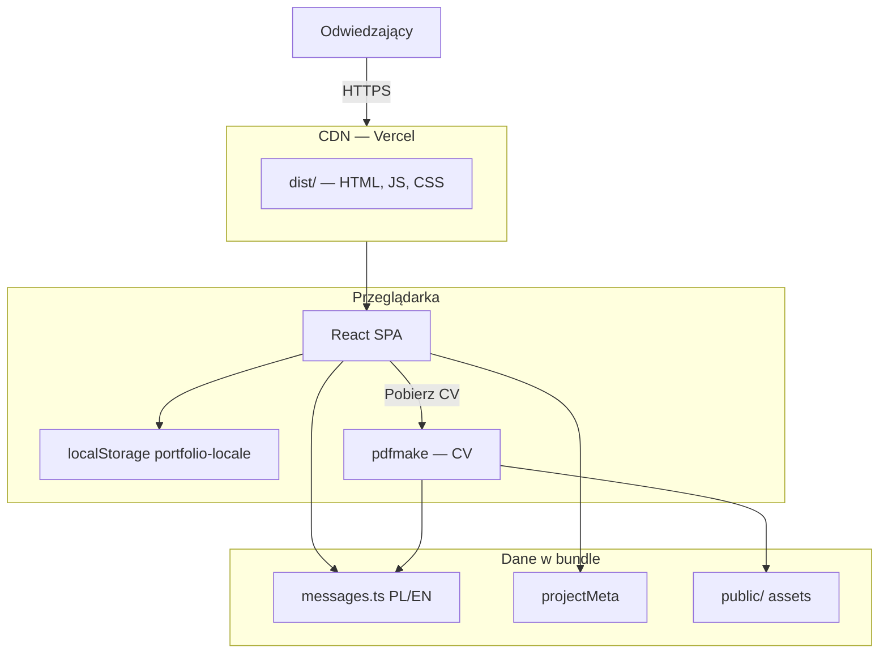
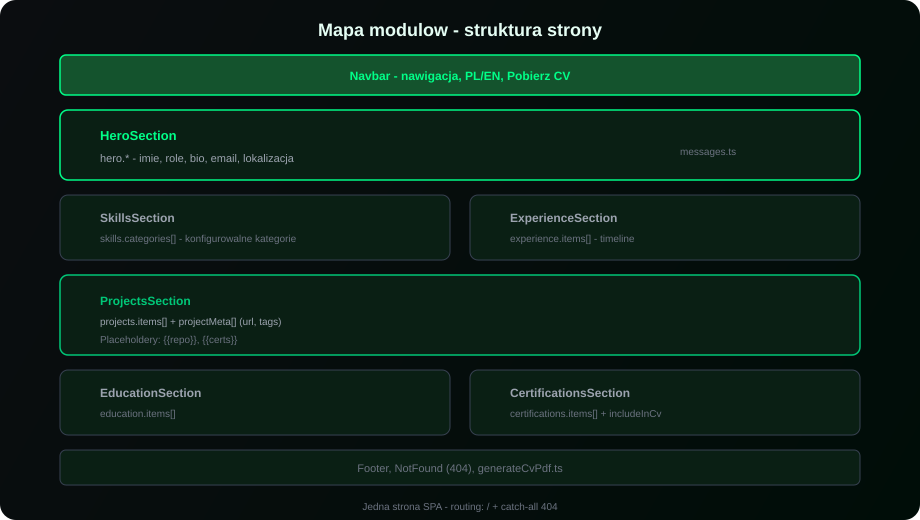
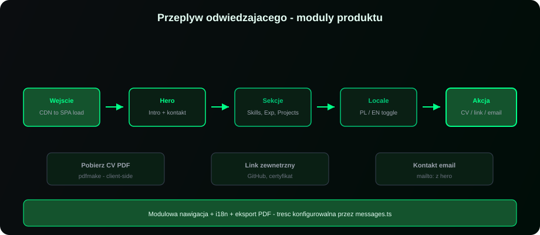

# Architektura — portfolio-website

Statyczna aplikacja React (SPA) bez backendu. Cała treść i logika działają po stronie klienta.

---

## Diagram wysokiego poziomu




---

## Przepływ danych


### 1. Wejście na stronę

URL → CDN serwuje `index.html` + bundle → React montuje aplikację.

### 2. Inicjalizacja locale

`LocaleProvider` czyta `localStorage` (`portfolio-locale`). Brak wartości → domyślnie EN. Aktualizuje `document.title`, meta description, OG tags.

### 3. Render sekcji

Komponenty sekcji używają `useLocale()` → `messagesPl` lub `messagesEn`.

### 4. Akcje użytkownika

| Akcja | Mechanizm |
|-------|-----------|
| Nawigacja kotwicowa | Scroll do `#section` (Navbar) |
| PL ↔ EN | Zmiana locale → re-render + localStorage |
| Link zewnętrzny | `<a target="_blank">` z kart projektów |
| Pobierz CV | Dynamic import pdfmake → PDF z `messages` + opcjonalne zdjęcie |

---

## Mapa modułów strony



Sekcje to **moduły konfigurowalne** — treść pochodzi z `messages.ts`, layout z komponentów w `src/components/`.

---

## Warstwy systemu

### Prezentacja (`src/components/`)

| Komponent | Odpowiedzialność |
|-----------|------------------|
| `Navbar` | Nawigacja, locale toggle, download CV |
| `HeroSection` | Intro, kontakt |
| `SkillsSection` | Grid kategorii umiejętności |
| `ExperienceSection` | Timeline (tablica `experience.items`) |
| `ProjectsSection` | Karty + merge z `projectMeta` |
| `EducationSection` | Lista wpisów edukacyjnych |
| `CertificationsSection` | Verified / upcoming certs |
| `ProjectDescriptionText` | Parser placeholderów `{{repo}}`, `{{certs}}` |

### Dane (`src/i18n/`)

| Plik | Rola |
|------|------|
| `messages.ts` | Single source of truth — treść PL/EN + typy |
| `LocaleProvider.tsx` | Context, meta tags, localStorage |
| `useLocale.ts` | Hook `t`, `locale`, `setLocale` |

### Narzędzia (`src/lib/`)

| Plik | Rola |
|------|------|
| `generateCvPdf.ts` | Budowa dokumentu PDF (pdfmake) |
| `parseProjectDescription.ts` | Placeholdery w opisach projektów |

### Konfiguracja (`src/config/`)

| Plik | Rola |
|------|------|
| `site.ts` | `SITE_URL`, `showPublicPhone` |

---

## Model danych treści

```
messages.ts
├── messagesPl / messagesEn
│   ├── meta           → SEO
│   ├── hero           → intro + kontakt
│   ├── skills         → categories[]
│   ├── experience     → items[]
│   ├── projects       → items[] (tekst)
│   ├── education      → items[]
│   ├── certifications → items[] + includeInCv
│   └── cvPdf          → etykiety PDF
└── projectMeta[]      → url, tags (wspólne dla obu języków)
```

Zmiana w `messages.ts` propaguje się do UI i PDF bez dodatkowej synchronizacji.

---

## Stack technologiczny

| Warstwa | Technologia | Uzasadnienie |
|---------|-------------|--------------|
| UI | React 18 + TypeScript | Komponenty, typowanie |
| Build | Vite 5 + SWC | Szybki dev, mały bundle |
| Style | Tailwind CSS 3 | Utility-first, dark theme |
| Motion | Framer Motion | Scroll animations, reduced motion |
| Routing | React Router v6 | `/` + catch-all 404 |
| PDF | pdfmake | Client-side generation |
| Hosting | Vercel | Zero-config static deploy |

---

## Poza zakresem

- API REST / GraphQL
- Baza danych
- Serwer Node w runtime
- SSR / SSG
- Zmienne środowiskowe (MVP)

---

## Przepływ odwiedzającego



Przepływ po modułach produktu — niezależny od konkretnej treści w `messages.ts`.

---

← [Wartość biznesowa](02-business.md) · [Wdrożenie →](deployment.md)
